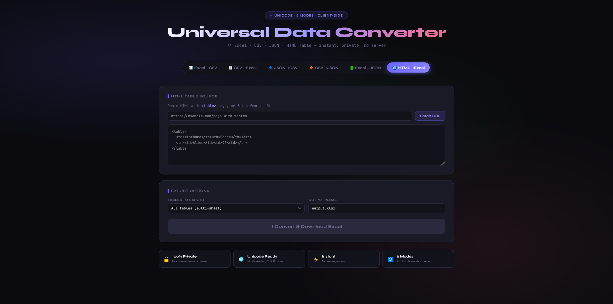
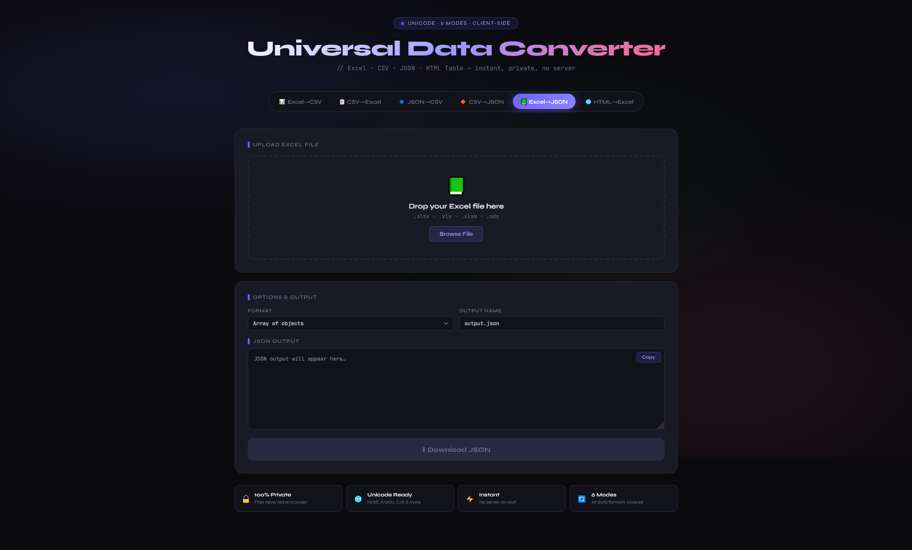
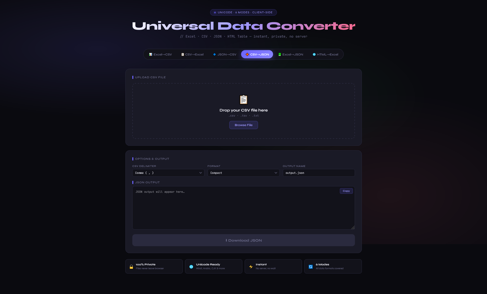
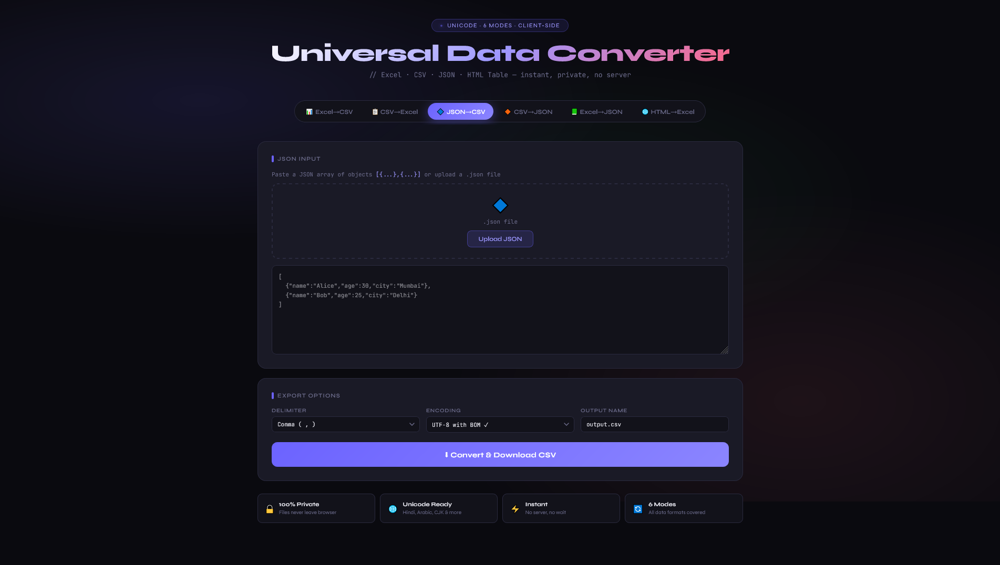
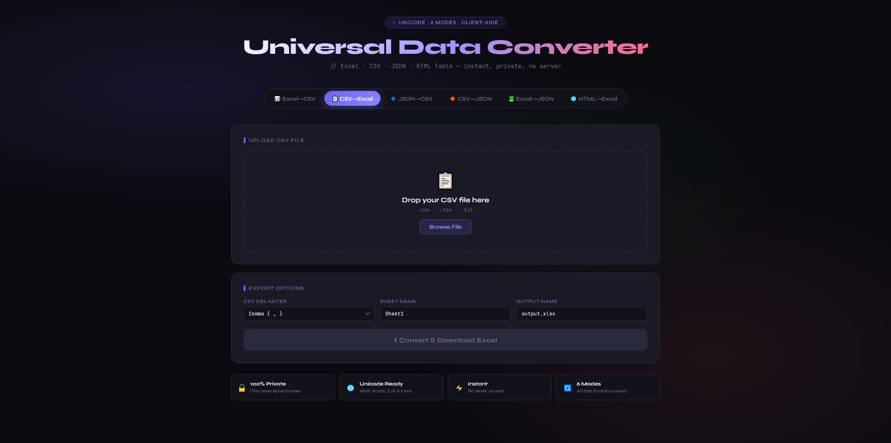
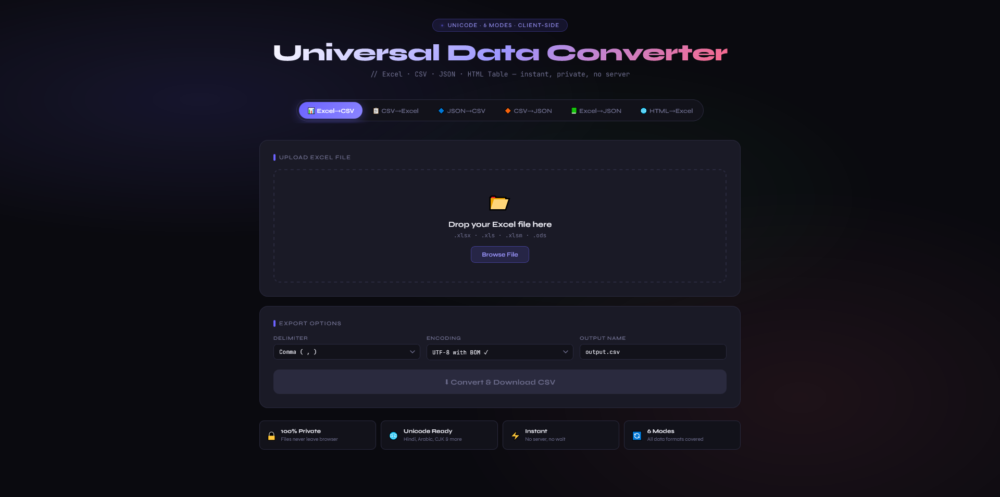

# excel-csv-converter 🔄

A fast, privacy-first Excel ↔ CSV converter that runs entirely in the browser with live preview and full Unicode support.

---

## ✨ Features

### 📊 Excel → CSV
- Supports: `.xlsx`, `.xls`, `.xlsm`, `.ods`
- Select any sheet from multi-sheet workbooks
- Choose delimiter:
  - Comma (,)
  - Semicolon (;)
  - Tab (\t)
  - Pipe (|)
- Export options:
  - UTF-8 with BOM (best for Excel Unicode support)
  - UTF-8 without BOM

---

### 📋 CSV → Excel
- Supports: `.csv`, `.tsv`, `.txt`
- Auto-detects BOM
- Proper handling of quoted fields
- Convert to Excel with custom sheet name

---

### 🌍 Full Unicode Support
- Works with:
  - Hindi
  - Arabic
  - CJK (Chinese, Japanese, Korean)
  - Emojis 😄
- Uses UTF-8 with BOM to ensure compatibility with Excel

---

### 👀 Live Preview
- Preview first 5 rows before conversion
- Displays:
  - Row count
  - Column count

---

### 🔒 100% Client-Side
- No server required
- No PHP or backend
- Files never leave your browser
- Powered by SheetJS via CDN

---

## 🧠 Why Use This?

- Privacy-first (no uploads)
- Lightweight and fast
- Works offline (after initial load)
- Simple UI, no learning curve

---

## 🛠️ Tech Stack

- HTML5 + CSS (custom properties)
- JavaScript + jQuery
- SheetJS (`xlsx.js`)
- Google Fonts:
  - Syne
  - JetBrains Mono
- Drag and Drop API

---

## 🚀 Getting Started

1. Clone the repository:
   ```bash
   git clone https://github.com/azhar-chaudhari/excel-csv-converter.git

## 📸 Screenshots
<p align="center">
  <br>
  <em>Main Interface</em>
</p>

<p align="center">
  <br>
  <em>Main Interface</em>
</p>

<p align="center">
  <br>
  <em>Main Interface</em>
</p>

<p align="center">
  <br>
  <em>Main Interface</em>
</p>

<p align="center">
  <br>
  <em>Main Interface</em>
</p>

<p align="center">
  <br>
  <em>Main Interface</em>
</p>